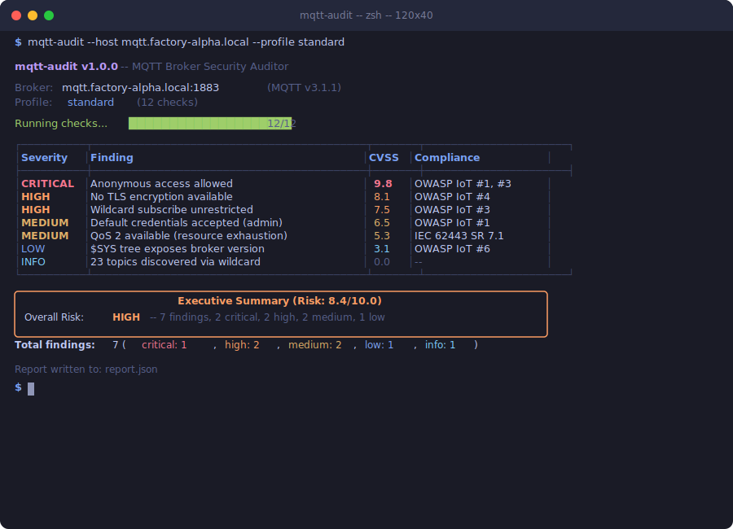

# mqtt-audit

<p align="center">
  
</p>

**MQTT broker security auditor** (v1.0.0 stable) -- comprehensive security testing for MQTT brokers covering authentication, encryption, access control, payload inspection, protocol abuse, and compliance mapping.

Part of the [isecwire](https://isecwire.com) open-source IoT security toolkit.

## Why

MQTT is the dominant messaging protocol in IoT and industrial environments. A misconfigured broker can expose telemetry data, allow unauthorised command injection to actuators, and leak operational metadata through the `$SYS` topic tree. Despite this, many production deployments still ship with anonymous access enabled, no TLS, and no topic-level ACLs.

**mqtt-audit** provides a fast, non-destructive way to surface these issues before an attacker does.

## Checks

### Core checks (all profiles)

| Check | What it tests | Severity on fail |
|---|---|---|
| `test_anonymous_access` | Connects without credentials | Critical |
| `test_credentials_required` | Connects with bogus credentials | Critical |
| `test_tls_available` | Probes the TLS port (default 8883) | High |
| `test_wildcard_subscribe` | Subscribes to `#` and inspects SUBACK | High |

### Standard profile (default)

| Check | What it tests | Severity on fail |
|---|---|---|
| `test_topic_enumeration` | Subscribes to `#` and `$SYS/#`, collects traffic | Medium / High |
| `test_write_access` | Publishes to a random test topic | Medium |
| `test_sys_tree_analysis` | Extracts broker version, uptime, client counts from `$SYS` | Medium |
| `test_qos2_abuse` | Tests if QoS 2 is available (resource exhaustion) | Medium |
| `test_will_message` | Tests will message injection on arbitrary topics | Low |
| `test_retained_messages` | Checks for sensitive data in retained messages | Medium |
| `test_mqtt5_features` | Probes MQTT v5 enhanced auth, shared subscriptions | Info |

### Thorough profile

| Check | What it tests | Severity on fail |
|---|---|---|
| `test_default_credentials` | Brute-force with common default credentials | Critical |
| `test_payload_inspection` | Detects plaintext passwords, PII, credit cards in payloads | Critical / High |
| `test_tls_certificate_validation` | Checks cert validity, expiry, CN/SAN match | High |
| `test_client_id_enumeration` | Tests predictable client IDs for session hijacking | Low |
| `test_max_connections` | Tests for connection rate limiting | Medium |
| `test_acl_mapping` | Probes read/write ACLs on common topic hierarchies | High / Medium |

## Features

- **Scan profiles:** `quick`, `standard`, `thorough` -- choose your depth
- **Output formats:** Rich terminal tables, JSON, CSV, Markdown reports
- **CVSS scoring:** Each finding receives a CVSS 3.1 score (0-10)
- **Compliance mapping:** Findings mapped to OWASP IoT Top 10, IEC 62443, CIS Controls, PCI DSS, GDPR
- **Executive summary:** Risk-scored overview for management reports
- **WebSocket support:** Test brokers accessible via ws:// and wss://
- **MQTT v5 probing:** Test enhanced authentication, shared subscriptions, topic aliases
- **Custom wordlists:** Supply your own credential lists for brute-force testing
- **Rich terminal UI:** Colored severity badges, progress display, topic tree views

## Installation

```bash
pip install .
```

Or install directly from the repository:

```bash
pip install git+https://github.com/isecwire/mqtt-audit.git
```

Requires Python 3.9+.

## Usage

```bash
# Quick scan against a local broker
mqtt-audit --host localhost --profile quick

# Standard scan (default) with credentials and JSON output
mqtt-audit --host broker.example.com --username admin --password secret --format json --output report.json

# Thorough scan with markdown report
mqtt-audit --host 10.0.0.50 --profile thorough --format markdown --output report.md

# Scan via WebSocket transport
mqtt-audit --host broker.example.com --port 8080 --websocket

# Custom credential wordlist
mqtt-audit --host broker.example.com --profile thorough --wordlist /path/to/creds.txt

# CSV output for spreadsheet import
mqtt-audit --host localhost --format csv --output findings.csv

# Verbose output for debugging
mqtt-audit --host localhost -v
```

Run as a Python module:

```bash
python -m mqtt_audit --host localhost
```

## CLI options

| Option | Description | Default |
|--------|-------------|---------|
| `--host` | Target broker hostname or IP (required) | -- |
| `--port` | MQTT plaintext port | 1883 |
| `--tls-port` | MQTT TLS port to probe | 8883 |
| `--username` | Username for authenticated checks | None |
| `--password` | Password for authenticated checks | None |
| `--output FILE` | Write report to file | None |
| `--timeout` | Per-check timeout in seconds | 5.0 |
| `--profile` | Scan profile: quick, standard, thorough | standard |
| `--format` | Output format: table, json, csv, markdown | table |
| `--mqtt-version` | MQTT protocol version: 3.1.1, 5 | 3.1.1 |
| `--websocket` | Use WebSocket transport | off |
| `--wordlist FILE` | Custom credential wordlist | built-in |
| `-v, --verbose` | Enable debug logging | off |

## Example output

```
mqtt-audit 1.0.0 -- MQTT broker security auditor

Target: localhost:1883  (TLS probe: 8883)  Profile: standard  Transport: TCP

                            mqtt-audit report
  Target: localhost:1883  |  TLS port: 8883  |  Time: 2026-04-03T...

              Executive Summary (Risk: 9.9/10.0)
  The MQTT broker at localhost was audited and 8 security finding(s)
  were identified. Overall risk rating: CRITICAL (9.9/10.0). 2 CRITICAL
  finding(s) require immediate remediation. ...

 #   Severity   CVSS   Title                                Remediation
 1   CRITICAL    9.8   Anonymous access allowed              Disable anonymous access...
 2   CRITICAL    9.8   Broker accepts invalid credentials    Review the authentication...
 3   HIGH        7.5   TLS not available on port 8883        Configure a TLS listener...
 4   HIGH        7.5   Wildcard subscribe allowed for ...    Restrict wildcard subs...
 5   MEDIUM      5.3   $SYS topic tree exposed               Restrict access to $SYS/#...
 6   MEDIUM      5.0   QoS 2 available -- resource exh...    Restrict QoS 2 to trusted...
 7   MEDIUM      6.5   Write access granted to 'anonymous'   Configure publish ACLs...
 8   LOW         4.3   Will message injection possible       Apply ACL rules to will...

                        Compliance References
 Framework          Reference   Description                  Related Findings
 OWASP IoT Top 10   I1          Weak, Guessable Passwords    Anonymous access allowed...
 IEC 62443-4-2      CR 1.1      Human user identification    Anonymous access allowed...
 ...

Total findings: 8  (critical: 2, high: 2, medium: 3, low: 1)
```

## Exit codes

| Code | Meaning |
|------|---------|
| 0 | No HIGH or CRITICAL findings |
| 1 | At least one HIGH or CRITICAL finding |

This makes mqtt-audit suitable for CI/CD pipelines and automated compliance checks.

## Disclaimer

This tool is intended for **authorised security testing only**. Always obtain written permission before scanning infrastructure you do not own. The authors accept no liability for misuse. See [LICENSE](LICENSE) for details.

## FAQ

### What is OWASP IoT Top 10?

**OWASP** (Open Web Application Security Project) is a non-profit that publishes lists of the most common security mistakes. The **OWASP IoT Top 10** lists the 10 most frequent security issues in IoT devices: weak passwords, insecure network services, lack of encryption, insecure interfaces, etc.

When mqtt-audit finds a problem, the report maps it to the relevant OWASP IoT category. This is a universal language that auditors, clients, and insurers all understand.

### Why audit an MQTT broker?

MQTT brokers are the communication backbone of IoT systems. A misconfigured broker can allow anyone to subscribe to all messages (data leak), publish commands to devices (unauthorized control), or extract credentials transmitted in plaintext. mqtt-audit systematically tests for all these issues.

### How is this used in practice?

```bash
mqtt-audit --host broker.client.com --profile thorough --format json --output report.json
```

This connects to the client's MQTT broker, runs 17 security checks (anonymous access, TLS, ACLs, default credentials, payload inspection), and generates a report with findings mapped to OWASP IoT Top 10 and IEC 62443.

## License

MIT -- Copyright (c) 2026 isecwire GmbH
